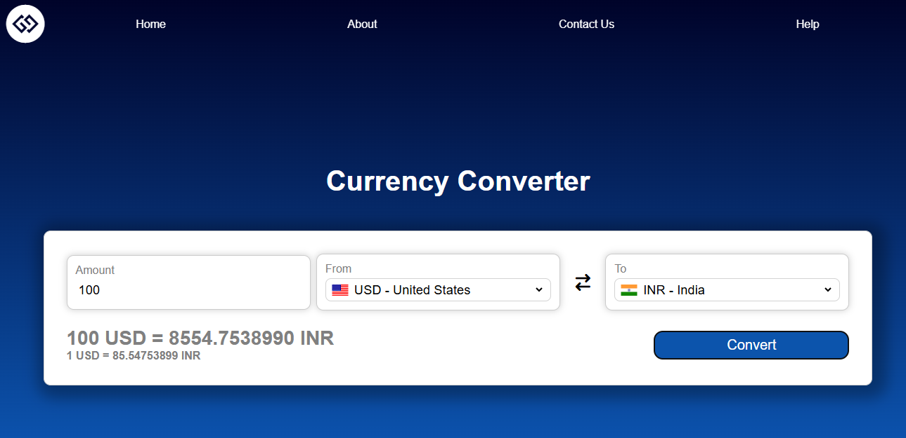
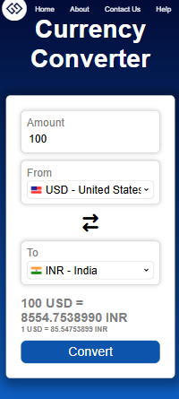

# Currency-Converter
A responsive and interactive web application that converts currencies using live exchange rates fetched from a third-party API. Built with **HTML**, **CSS**, and **JavaScript**.
## Features
1. Convert between hundreds of global currencies
2. Real-time exchange rates via API
3. Dynamic country flag icons based on currency
4. Swap between currencies using the exchange button
5. Input validation for amount
6. Fully responsive for desktop, tablet, and mobile
## Tech Stack
1. HTML5
2. CSS3 – Flexbox, responsive layout, gradients, custom styles
3. JavaScript (ES6+) – API integration, DOM manipulation, validation
## Demo
### Desktop View

### Mobile View

## API Used
1. [Fawaz Ahmed Exchange Rate API](https://github.com/fawazahmed0/exchange-api)
   - Base URL: https://cdn.jsdelivr.net/npm/@fawazahmed0/currency-api@latest/v1/currencies
## Dependencies
1. [Font Awesome](https://fontawesome.com/) for icons (included via CDN)
2. [FlagsAPI](https://flagsapi.com/) for country flag images
## How It Works
### 1. Dropdown Population
`codes.js` contains an object mapping currency codes to country names and flag codes. These are used to populate the `<select>` dropdowns dynamically on page load.
### 2. Flag Update
When a user selects a different currency from the dropdown, the corresponding country flag is updated using [FlagsAPI](https://flagsapi.com/).
### 3. Currency Conversion
Clicking the **Convert** button fetches the latest exchange rate from the API and calculates the converted amount. Both the exchange rate and result are displayed to the user.
### 4. Swap Functionality
Clicking the **Swap** button switches the "From" and "To" currencies and updates the UI, including flags and exchange rates, accordingly.
## Getting Started
### 1. Clone the repo
```cmd
git clone https://github.com/joellajacob/Currency-Converter.git
cd Currency-Converter
```
### 2. Open `index.html` in your browser
## License
This project is licensed under the MIT License.


